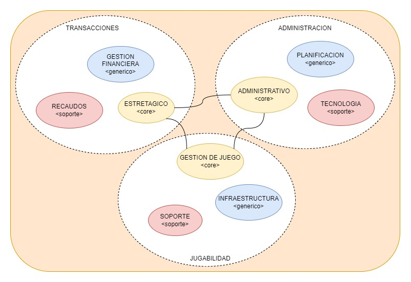
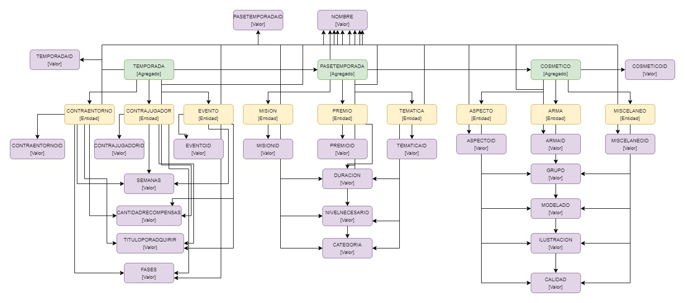
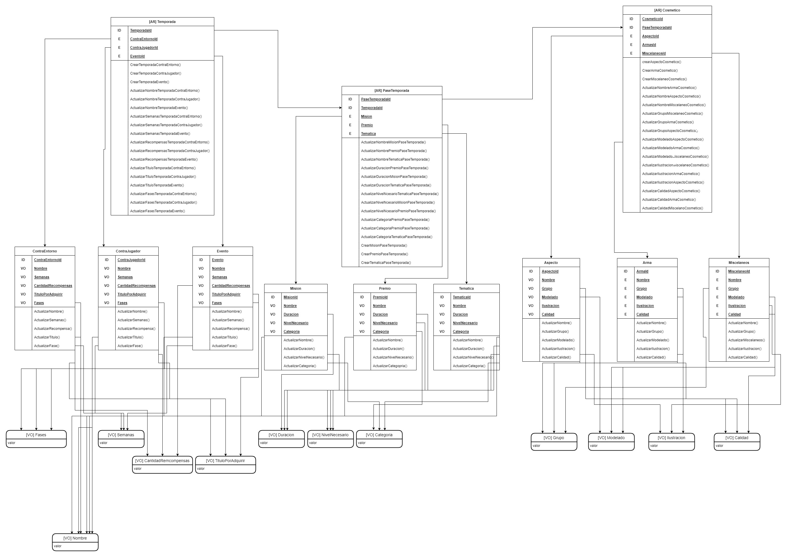
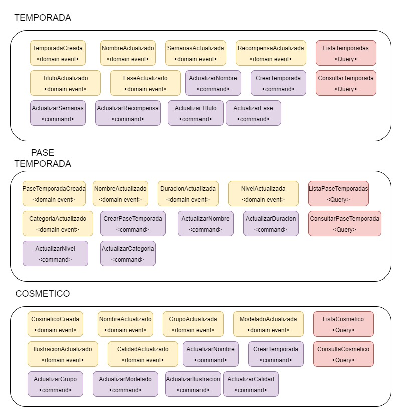

# Temporadas

# RETO SOFKA

Una empresa de videojuegos desea implementar sistema de transacciones para generar dinero, por lo que se implementara un sistema de temporadas en las cuales los jugadores podran adquirir ciertos beneficios mediante un pase de temporada que desbloqueara ciertos elementos cosmeticos para sus personajes.

----------------------------------------------------------------

#Big Picture

#Diagramas

#Eventos

